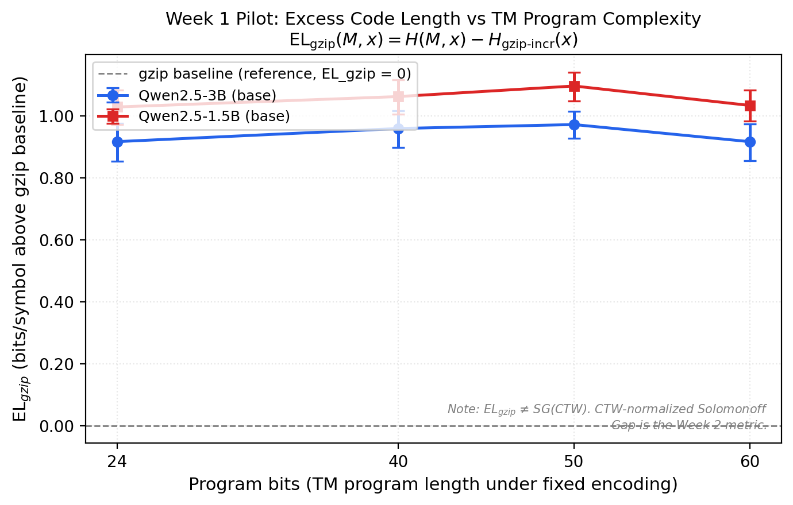

# SolomonoffBench

**Empirical benchmark measuring how many extra bits per symbol LLMs waste compared to the theoretically optimal predictor (Solomonoff induction), as a function of formally computed Kolmogorov complexity.**

[](https://doi.org/10.5281/zenodo.21884224)
[](paper/preprint.pdf)
[](https://huggingface.co/datasets/ajinkya-awari/solomonoff-bench)
[](LICENSE)
[](tests/)
[](https://github.com/ajinkya-awari/solomonoff-bench)

---

## Hero Figure

> **Figure 1 (Week 1 Pilot)** — EL_gzip vs TM program complexity for two local LLMs.
> Results from Kaggle T4 GPU inference; figure generated after benchmark run.



*Note: EL_gzip is the Week 1 pilot metric (gzip-normalized excess code length). The CTW-normalized Solomonoff Gap (SG) is the Week 2+ research metric. They are not the same quantity and are never plotted on the same axis.*

---

## What This Is

AIXI requires Solomonoff induction as its predictive component — but Solomonoff induction is incomputable. Modern LLMs are the best practical sequence predictors available today. This project asks:

> **Can free, reproducible LLMs approximate the universal prediction behaviour required by AIXI-like agents on program-generated binary sequences of increasing complexity?**

The **Solomonoff Gap (SG)** metric quantifies exactly how many bits per symbol an LLM wastes over the best practical Solomonoff approximator (CTW), as a function of formally computed Kolmogorov complexity K.

**Week 1 pilot:** 300 TM-generated binary sequences, 4 complexity levels, 2 local models, gzip-normalized `EL_gzip` metric.  
**Week 2 (current):** CTW-normalized `SG` on the 300 TM-generated sequences only
(600 model-sequence pairs across two models). The extended 2,400-sequence dataset
(TM + CA + LFSR + canary) is generated and available, but SG computation on it is
future work planned for Week 3.

---

## Key Results (Week 1 Pilot)

| Model | L1 (24 bits) | L2 (40 bits) | L3 (50 bits) | L4 (60 bits) | Neg. deltas | Invalid mass |
|-------|:------------:|:------------:|:------------:|:------------:|:-----------:|:------------:|
| Qwen2.5-3B (base) | 0.917 | 0.959 | 0.972 | 0.917 | 0/300 (0%) | 34.3% |
| Qwen2.5-1.5B (base) | 1.029 | 1.062 | 1.096 | 1.034 | 0/300 (0%) | 35.9% |

EL_gzip values in bits/symbol above the incremental gzip baseline. Both models: **PASS**.

**Findings:**
- Both models waste ~1 bit/symbol over gzip on TM-generated sequences
- Smaller model (1.5B) wastes more bits than larger (3B) — expected
- EL_gzip spread across complexity levels is small (0.055–0.068 bits/sym), suggesting gzip is insufficiently sensitive to K — motivates CTW upgrade in Week 2
- Zero negative gzip deltas across 600 scored sequences — incremental gzip is stable

*Benchmark run on Kaggle T4. Models: ungated HuggingFace base models. See `notebooks/03_benchmark_local_kaggle.ipynb`.*

---

## Repository Structure

```
solomonoff-bench/
├── src/solomonoff_bench/
│   ├── sequences/          # TM simulator + sequence generator
│   ├── models/             # Tokenizer validation + local HF scorer
│   ├── baselines/          # Incremental gzip + random baselines
│   ├── metrics/            # EL_gzip computation
│   ├── analysis/           # Plots + stats + mock results
│   └── benchmark.py        # Resumable main runner
├── notebooks/
│   ├── 01_generate_sequences.ipynb
│   ├── 02_validate_tokenizers.ipynb
│   ├── 03_benchmark_local_kaggle.ipynb   ← run on Kaggle T4
│   └── 04_analysis_and_plots.ipynb
├── data/sequences_mvp.json              ← gitignored (300 sequences)
├── results/
│   ├── el_gzip_results.csv
│   ├── figures/fig1_mvp_el_gzip.png
│   └── minimum_viable_result_check.txt
└── tests/                               ← 43 tests, all passing
```

---

## Quickstart

```bash
git clone https://github.com/ajinkya-awari/solomonoff-bench
cd solomonoff-bench
pip install -e ".[dev]"

# Generate 300 sequences (CPU, ~1s)
python src/solomonoff_bench/sequences/generate_sequences.py

# Run tests
python -m pytest tests/ -v

# Full benchmark (needs Kaggle T4 — see notebooks/03_benchmark_local_kaggle.ipynb)
```

---

## Ten Non-Negotiable Rules

1. TM output-transducer convention — written symbol emitted at every transition
2. Sequences are ASCII strings of `"0"`/`"1"` characters — never packed binary
3. Incremental gzip only: `8*(len(gzip(prefix+suffix)) - len(gzip(prefix))) / len(suffix)`
4. Negative gzip deltas are logged and reported — never silently clamped
5. Invalid-token mass saved **before** renormalization in every scorer run
6. Direct `model(**inputs).logits[:, -1, :]` forward pass — never `model.generate(output_scores=True)`
7. 5-prompt toy gate must pass before any full benchmark run
8. `EL_gzip` ≠ Solomonoff Gap — never describe or plot them as the same metric
9. Week 1 results never claim CTW-normalized SG
10. All infrastructure runs at £0 — Kaggle T4 for GPU, no paid APIs

---

## Citation

```bibtex
@misc{awari2026solomonoff,
  title   = {Can Free LLMs Serve as Practical Context Models for AIXI?
             A Pilot Benchmark on Program-Generated Binary Sequences},
  author  = {Awari, Ajinkya},
  year    = {2026},
  doi     = {10.5281/zenodo.21884224},
  url     = {https://zenodo.org/records/21884225},
  note    = {Preprint. Zenodo}
}
```

---

## Related Work

- Delétang et al. 2023 — *Language Modeling Is Compression* (arXiv:2309.10668) — closest prior work; our K-conditioned design asks a fundamentally different question
- Hutter 2000 — *A Theory of Universal Artificial Intelligence Based on Algorithmic Complexity*
- Willems, Shtarkov & Tjalkens 1995 — *The Context-Tree Weighting Method* (CTW baseline)
