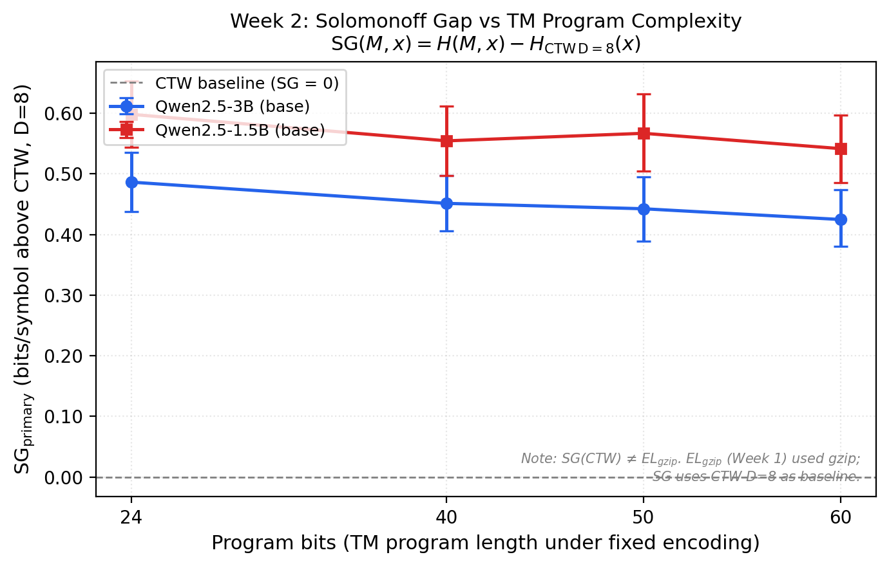

<div align="center">


[](tests/)
[](https://doi.org/10.5281/zenodo.21884224)
[](paper/Preprint.pdf)
[](paper/Preprint.pdf)
[](https://huggingface.co/datasets/ajinkya-awari/solomonoff-bench)
[](LICENSE)
[](https://github.com/ajinkya-awari/solomonoff-bench)

</div>

**SolomonoffBench** measures the *Solomonoff Gap* (SG) — the per-symbol bits an LLM wastes above the best practical universal predictor — on 300 binary sequences generated by Turing machines with formally computed Kolmogorov complexity.

AIXI uses Solomonoff induction as its context model. Solomonoff induction is incomputable. We ask: *how far are free LLMs from filling that role?* Across two Qwen2.5 models and 600 scored sequence-model pairs, the answer is: **not close** — and the gap is flat across all complexity levels, which is the more pessimistic result.

---

## Results

### Week 1 — EL_gzip Pilot


*Mean gzip-normalized excess code length with 95% CI. Lower dashed line = gzip baseline (0.0 bps); upper dashed line = random predictor (1.0 bps). Qwen2.5-3B sits between both; Qwen2.5-1.5B exceeds random at every complexity level.*

| Model | L1 (24 b) | L2 (40 b) | L3 (50 b) | L4 (60 b) | Inv. mass |
|-------|:---------:|:---------:|:---------:|:---------:|:---------:|
| Qwen2.5-3B | 0.917 ± 0.28 | 0.959 ± 0.27 | 0.972 ± 0.19 | 0.917 ± 0.27 | 34.3% |
| Qwen2.5-1.5B | 1.028 ± 0.24 | 1.062 ± 0.25 | 1.096 ± 0.20 | 1.034 ± 0.23 | 35.9% |
| gzip baseline | 0.000 | 0.000 | 0.000 | 0.000 | — |
| random ceiling | 1.000 | 1.000 | 1.000 | 1.000 | — |

EL_gzip in bits/symbol. Negative deltas: 0/300 for both models.

### Week 2 — CTW-Normalized Solomonoff Gap



*Mean Solomonoff Gap at CTW D=8 with 95% CI. Dashed line = CTW baseline (SG = 0). Positive SG means the model exceeds the best practical universal predictor. Both profiles are flat — this is a model property, not a gzip artefact.*

| Model | L1 (24 b) | L2 (40 b) | L3 (50 b) | L4 (60 b) |
|-------|:---------:|:---------:|:---------:|:---------:|
| Qwen2.5-3B | 0.487 ± 0.21 | 0.452 ± 0.20 | 0.443 ± 0.23 | 0.425 ± 0.20 |
| Qwen2.5-1.5B | 0.598 ± 0.25 | 0.555 ± 0.26 | 0.567 ± 0.28 | 0.542 ± 0.25 |
| CTW baseline | ≈ 0.010 | — | — | ≤ 0.924 |

SG in bits/symbol at CTW D=8. Negative SG: 0/600.

**What we found:**
- Neither model beats gzip or CTW on TM-generated sequences
- SG is flat across a 2.5× range of program complexity (Δ ≤ 0.062 bps) — LLMs do not track K
- Zero negative SG across 600 pairs — no memorization signal, benchmark integrity holds
- 3B model is ~0.11 bps closer to the Solomonoff limit than 1.5B across all levels
- The flat profile is the key result: there is no complexity regime where current free models work

---

## What This Measures

The **Solomonoff Gap** is:

```
SG(M, x) = H(M, x) − H_CTW(x)   [bits per symbol]
```

SG = 0 means the model matches CTW — the best practical approximation to Solomonoff induction. SG > 0 quantifies the remaining gap to universal prediction optimality.

The **Week 1 pilot metric** substitutes incremental gzip for CTW:

```
EL_gzip(M, x) = H(M, x) − H_gzip_incr(x)
```

`EL_gzip` and SG are distinct metrics measured on different baselines. Never plotted on the same axis.

---

## Design

- **TM simulator** — one-tape binary output transducer; the symbol written at each transition is emitted (not from final tape)
- **300 sequences** — 75 per complexity level (24 / 40 / 50 / 60 program bits), 200 symbols each, globally deduplicated
- **Tokenizer gate** — validates P(0) + P(1) ≥ 0.01 on 5 toy prompts; logs invalid-token mass before renormalization
- **Direct logit scoring** — `model(**inputs).logits[:, -1, :]`; never `model.generate(output_scores=True)`
- **Incremental gzip** — `8 * (len(gzip(prefix+suffix)) − len(gzip(prefix))) / len(suffix)`; negative deltas logged, never clamped
- **CTW baseline** — KT estimator, binary alphabet, depths D=4, 8, 12; SG reported at D=8 (primary)
- **Free compute** — Kaggle T4 GPU (15 GB), no paid APIs

<details>
<summary>Reproducibility details</summary>

| Setting | Value |
|---------|-------|
| Models | `Qwen/Qwen2.5-3B`, `Qwen/Qwen2.5-1.5B` (ungated base models) |
| Compute | Single Kaggle T4, zero cost |
| Why base models | Instruction-tuned variants fail the tokenizer gate (near-zero binary mass) |
| Context | 100 symbols context → score next 100 symbols |
| Prompt | `Here is a binary sequence: 0 1 0 ... The next symbol is:` (trailing space) |
| Tokenizer gate threshold | Binary mass ≥ 0.01 (both models cleared: 65.4% / 63.5%) |
| Invalid-token mass | 34.3% (3B), 35.9% (1.5B) — all scores use renormalized binary probabilities |
| Checkpointing | Every 50 sequences; Kaggle session-safe |

</details>

---

## Quick Start

```bash
git clone https://github.com/ajinkya-awari/solomonoff-bench
cd solomonoff-bench
pip install -e ".[dev]"

# Generate 300 TM sequences (CPU, ~1s)
python src/solomonoff_bench/sequences/generate_sequences.py

# Run tests
python -m pytest tests/ -v

# CTW/SG computation on existing results (CPU, ~30s)
python scripts/compute_sg.py

# Full LLM benchmark — needs Kaggle T4
# See notebooks/03_benchmark_local_kaggle.ipynb
```

---

## Repository

```
solomonoff-bench/
├── src/solomonoff_bench/
│   ├── sequences/          ← TM simulator + sequence generator
│   ├── models/             ← Tokenizer validation + HF forward-pass scorer
│   ├── baselines/          ← Incremental gzip + CTW baselines
│   ├── metrics/            ← EL_gzip + SG computation
│   ├── analysis/           ← Plots, bootstrap CI, MVP check
│   └── benchmark.py        ← Resumable runner (checkpoint every 50)
├── notebooks/
│   ├── 01_generate_sequences.ipynb
│   ├── 02_validate_tokenizers.ipynb
│   ├── 03_benchmark_local_kaggle.ipynb   ← run on Kaggle T4
│   └── 04_analysis_and_plots.ipynb
├── data/
│   ├── sequences_mvp.json               ← gitignored (300 TM sequences)
│   └── sequences_full.json              ← 2,400 sequences (TM + CA + LFSR + canary)
├── scripts/
│   ├── compute_sg.py                    ← Week 2 CTW/SG computation
│   └── build_full_dataset.py
├── results/
│   ├── el_gzip_Qwen--Qwen2.5-3B.csv    ← 300 rows, Week 1
│   ├── el_gzip_Qwen--Qwen2.5-1.5B.csv  ← 300 rows, Week 1
│   ├── el_gzip_results_combined.csv     ← 600 rows (both models)
│   ├── sg_ctw_results.csv               ← 600 rows, Week 2 CTW/SG
│   ├── minimum_viable_result_check.txt  ← PASS verdict, both models
│   └── figures/
│       ├── fig1_mvp_el_gzip.png         ← Week 1 pilot figure
│       └── fig1_v2_sg_ctw.png           ← Week 2 SG figure
└── tests/                               ← 93 tests, all passing
```

---

## Ten Non-Negotiable Rules

1. TM output-transducer convention — written symbol emitted at every transition
2. Sequences are ASCII `"0"`/`"1"` strings — never packed binary
3. Incremental gzip only: `8*(len(gzip(prefix+suffix)) − len(gzip(prefix))) / len(suffix)`
4. Negative gzip deltas logged and reported — never silently clamped
5. Invalid-token mass saved **before** renormalization in every scorer run
6. Direct `model(**inputs).logits[:, -1, :]` — never `model.generate(output_scores=True)`
7. 5-prompt toy gate must pass before any full benchmark run
8. `EL_gzip` ≠ Solomonoff Gap — never describe or plot them as the same metric
9. Week 1 outputs never claim CTW-normalized SG
10. All infrastructure runs at £0 — Kaggle T4 for GPU, no paid APIs

---

## Citation

```bibtex
@misc{awari2026solomonoff,
  title   = {Can Free LLMs Serve as Practical Context Models for AIXI?
             A Pilot Benchmark on Program-Generated Binary Sequences},
  author  = {Awari, Ajinkya},
  year    = {2026},
  doi     = {10.5281/zenodo.21884224},
  url     = {https://zenodo.org/records/21884225},
  note    = {Preprint. Zenodo}
}
```

---

## Related Work

- Delétang et al. 2023 — *Language Modeling Is Compression* ([arXiv:2309.10668](https://arxiv.org/abs/2309.10668)) — closest prior; our K-conditioned design isolates algorithmic complexity as the controlled variable
- Hutter 2000 — *A Theory of Universal Artificial Intelligence Based on Algorithmic Complexity*
- Willems, Shtarkov & Tjalkens 1995 — *The Context-Tree Weighting Method* (CTW baseline)


